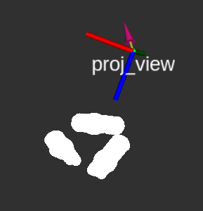
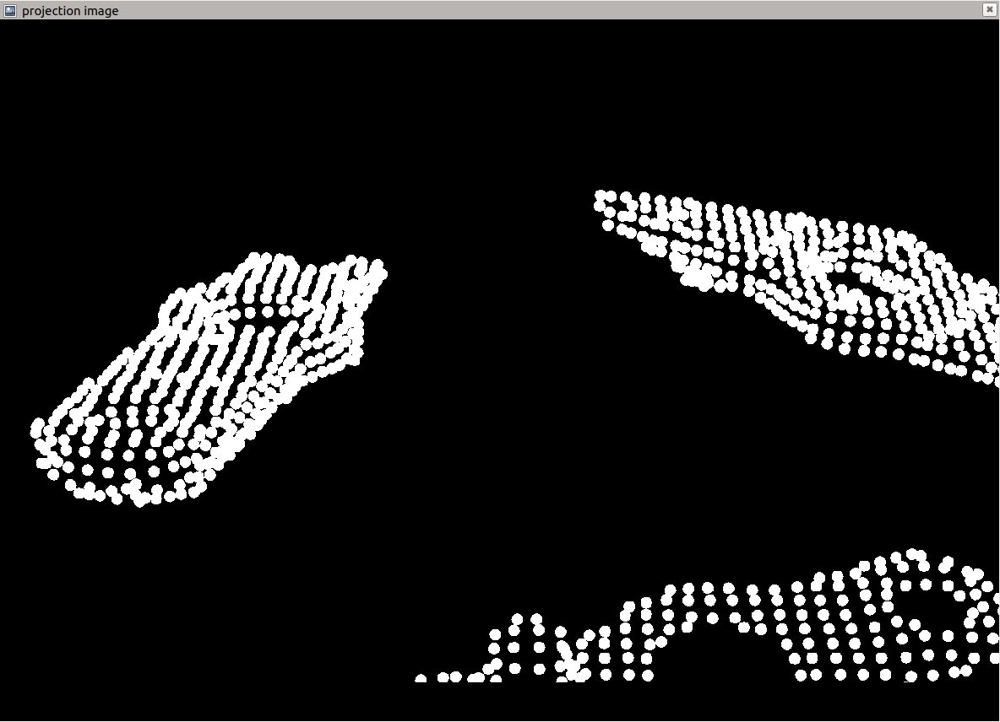

# Point Cloud Projection

## Setup
* Download the [`rviz_camera_stream`](https://github.com/uml-robotics/rviz_camera_stream) plugin to your `src` directory: `git clone git@github.com:uml-robotics/rviz_camera_stream.git`
* Enable a "Toggle fullscreen mode" shortcut `Super + F11` in keyboard settings
### If You Want To Set Up Your Own Rviz Configuration From An Empty Configuration
* Change the Fixed Frame to the one being used
* It is reccommended to add a TF display to see the location of the projector
* If you plan to project point clouds, add displays for them
* If you plan to project the navigation MarkerArray, add a MarkerArray display and set the topic to `/visualization_marker_array`
* Add an Image display and set the topic to `/proj_view/image` (This will be the image we output to the projector)
* Add any other displays you need
* Add a CameraPub display
  * Set the image topic to `/proj_view/image` and the camera info topic to `/proj_view/camera_info`
  * Under "Visibility", choose what you want visible from `proj_view`

## Running
Notes:
* The fixed frame in the Rviz confing is currently set to `projector_turret_base_link`
* The projection image is the view from the `proj_view` TF frame in Rviz
* `proj_link`'s parent is currently `base_link`
* `projector_camera_info.yaml` is set up for a ViewSonic PA503W projector 
### Projecting Point Clouds
* Launch point cloud projection: `roslaunch point_cloud_projection point_cloud_projection.launch`
* Run the `fetch_projector.rviz` Rviz config: `roscd point_cloud_projection && rviz -d rviz/fetch_projector.rviz`, or your own config
* Run `image_view` with `rosrun image_view image_view image:=/proj_view/image`
* Make the image fullscreen on the projector screen by pressing `Super + F11`
* The projector should be pointed in the direction of the point cloud

### Projecting Navigation Path
* Launch point cloud projection: `roslaunch point_cloud_projection point_cloud_projection.launch`
* Run the marker publishing node: `rosrun point_cloud_projection marker_node`
* Run the `fetch_projector.rviz` Rviz config: `roscd point_cloud_projection && rviz -d rviz/fetch_projector.rviz`, or your own config
* Run `image_view` with `rosrun image_view image_view image:=/proj_view/image`
* Make the image fullscreen on the projector screen by pressing `Super + F11`
* The projector should be pointed at the floor in front of the robot

## Launch Files
`camera_publisher.launch` uses `projector_camera_info.yaml` to publish `/proj_view/camera_info`, which is a topic of type sensor_msgs::CameraInfo

`tf_publisher.launch` creates 2 static transform publishers `proj_link` and `proj_view`. `proj_link` is the center of the bottom of the projector, and `proj_view` is the lense of the projector

`point_cloud_projection.launch` launches both `camera_publisher.launch` and `tf_publisher.launch`
